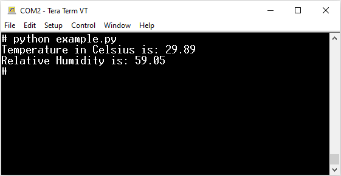

# SHT31 Temperature & Humidity Sensor

The SHT31 is part of a family of highly accurate temperature and humidity
sensors developed by [Sensirion AG](https://www.sensirion.com/).

## Prerequisites

On the Raspberry Pi, you first need to enable the I2C bus:

```bash
sudo raspi-config nonint do_i2c 0
```

Alternatively, you can execute `sudo raspi-config` and enable the I2C bus from
the configuration UI.

## Installing the library

You can download the most recent version of the library from the
[Releases](https://github.com/prdktntwcklr/python-sht31/releases) section and
install it using `pip`:

```bash
pip install python-sht31-0.1.0.tar.gz
```

## Example output


